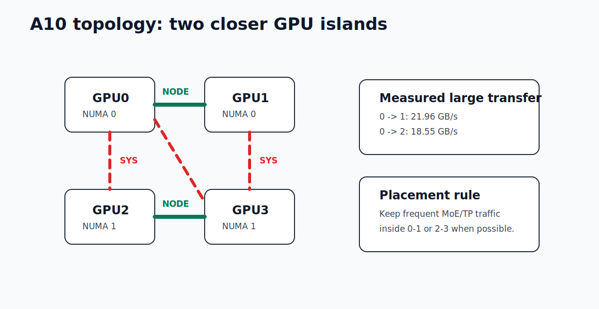
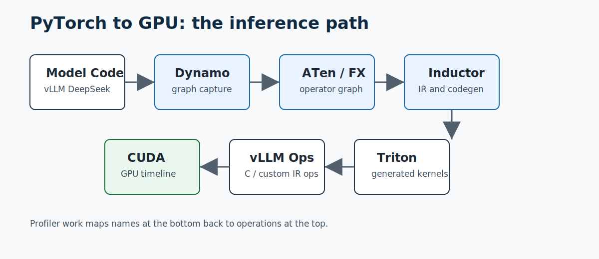
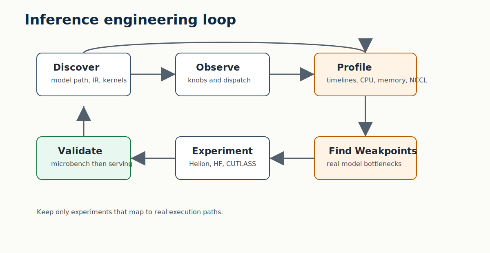
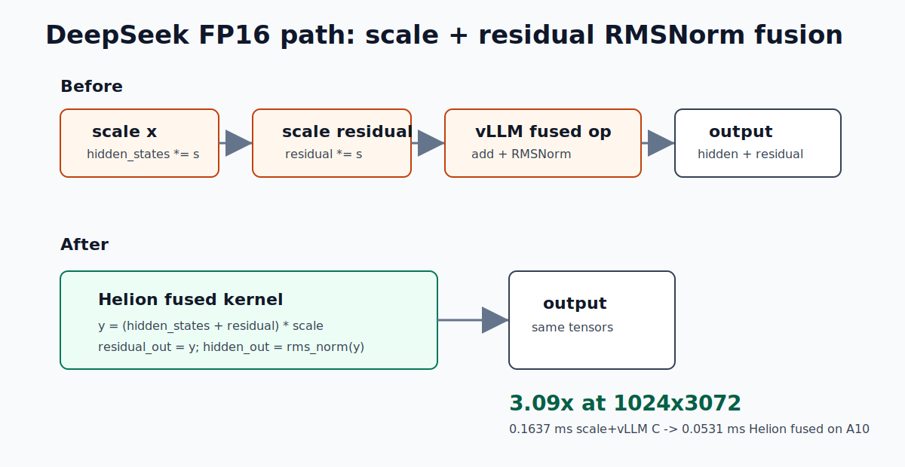

# Inference Engineering Notes: From PyTorch Graphs to DeepSeek Kernel Wins on A10

Inference engineering starts out looking like a pile of unrelated tools.

There is PyTorch Profiler. There is `torch.compile`. There are Dynamo graphs, ATen graphs, Inductor dumps, Triton kernels, CUDA kernels, Nsight Systems timelines, Nsight Compute reports, NCCL logs, NUMA topology, GPU peer bandwidth, vLLM custom ops, and then a whole universe of kernel libraries: Helion, CUTLASS, CuTeDSL, Hugging Face kernels, Liger, FlashInfer, and whatever the model runtime already ships.

The trick is not to learn these as a list.

The trick is to learn the path.

This investigation was a small lab around vLLM, PyTorch, and DeepSeek-style inference on a single server with four NVIDIA A10 GPUs. The goal was not just to run profilers. The goal was to build the inference-engineer reflex:

1. understand the stack;
2. observe the knobs;
3. profile the actual workload;
4. find weak points;
5. try kernel-level changes;
6. keep only the changes that map back to real model execution.

By the end, two useful DeepSeek-on-A10 findings emerged:

- a Helion fusion candidate in the DeepSeek/vLLM path with about a 3x microbenchmark speedup;
- a topology-aware MoE placement rule: keep frequent expert co-activation traffic inside the closer GPU pairs, because cross-island GPU communication costs about 16% bandwidth on this machine.

This is the story of getting there.

Diagrams used in this article:

- [PyTorch to GPU stack](diagrams/pytorch_to_gpu_stack.svg)
- [Profiling and optimization loop](diagrams/profiling_optimization_loop.svg)
- [DeepSeek Helion fusion](diagrams/deepseek_helion_fusion.svg)
- [A10 GPU topology](diagrams/a10_gpu_topology.svg)

## The Machine

The box had four local NVIDIA A10 GPUs. No remote GPU nodes, no NVLink, no NVSwitch.

That matters.

`nvidia-smi topo -m` showed two closer GPU islands:

```text
GPU0 <-> GPU1: NODE
GPU2 <-> GPU3: NODE
cross-island pairs such as GPU0 <-> GPU2: SYS
```

So this is not an NVLS machine. NVLS is NVIDIA's NVLink SHARP path for collectives on NVLink/NVSwitch systems. On this A10 server, the relevant question is PCIe and NUMA behavior.



The lab was placed under `/scratch/deepseek-prof`, with all caches and profiler outputs redirected to `/scratch`, because home storage was limited. That included Torch, Triton, Hugging Face, CUDA, vLLM, and profiler artifacts. This sounds boring, but it is one of the first practical rules of serious profiling: traces and compiler caches get large fast.

## Step 1: Discovering the Stack

The first stage was just following execution downward.



At the top, there is model code. For DeepSeek in vLLM, the relevant file is:

```text
vllm/model_executor/models/deepseek_v2.py
```

Inside it, the decoder layer has the usual transformer rhythm:

```text
input RMSNorm
self attention / MLA
post-attention RMSNorm
MLP or MoE
```

The dense MLP path is:

```text
gate_up_proj -> SiluAndMul -> down_proj
```

The residual normalization path goes through vLLM's shared `RMSNorm` layer. For residual cases, that becomes:

```text
ir.ops.fused_add_rms_norm.maybe_inplace(...)
```

That line is a doorway. It means model code is not the end of the story. vLLM's IR op can dispatch to different implementations:

- native PyTorch;
- vLLM C custom kernels;
- experimental external providers, such as Oink or our Helion provider.

Below that, PyTorch may run eagerly or enter `torch.compile`, where the path becomes:

```text
Python model code
  -> Dynamo graph capture
  -> ATen / FX graph
  -> Inductor IR
  -> generated Triton/CUDA code
  -> GPU kernels on the timeline
```

The important lesson: if you want to optimize inference, you need to know where an operation lives at every level. A line in model code might become an ATen op, a vLLM custom op, a Triton kernel, or a call into a CUDA extension.

## Step 2: Observing the Knobs

The next stage was observing all the control surfaces.

There are runtime knobs:

- vLLM tensor parallel size;
- vLLM compile settings;
- custom op enablement;
- CUDA graph behavior;
- NCCL environment variables;
- CPU affinity and NUMA placement.

There are compiler knobs:

- Dynamo capture behavior;
- Inductor codegen;
- Triton autotuning;
- cache locations;
- graph breaks.

There are profiler knobs:

- PyTorch Profiler schedules;
- Chrome trace export;
- Nsight Systems kernel timelines;
- Nsight Compute kernel-level counters;
- CPU profiling;
- memory profiling;
- NCCL topology dumps.

And there are kernel-library knobs:

- vLLM C kernels;
- Helion autotuning;
- Hugging Face kernel hub;
- CUTLASS/CuTeDSL;
- FlashInfer;
- Liger/quack-style normalization kernels.

The hard part is not turning everything on. The hard part is deciding which knob is relevant to the bottleneck in front of you.

## Step 3: Profiling for Weak Points

The lab started with smoke tests and profiler traces, then moved into more realistic vLLM workloads.



The useful sequence was:

1. run small PyTorch programs and inspect Dynamo / ATen / Inductor output;
2. run vLLM benchmark workloads;
3. collect PyTorch Profiler traces;
4. collect Nsight Systems timelines;
5. inspect kernel names and time distribution;
6. map kernels back to model code;
7. only then try replacements.

This avoids a common trap: optimizing a pretty kernel benchmark that never appears in the real model path.

For DeepSeek-style models, several candidates were worth checking:

- RMSNorm and residual RMSNorm;
- MLP `SiluAndMul`;
- MoE expert routing and expert GEMMs;
- MLA-adjacent normalization and reshaping;
- NCCL communication between GPU shards.

Some ideas did not survive contact with the workload. Plain Helion GEMM was not better than cuBLAS on the tested shapes. CuTeDSL looked interesting, but vLLM's FlashInfer CuTeDSL MoE paths in this checkout were mainly SM100/NVFP4-oriented, while this host is A10 `sm_86`.

That is still progress. A negative result is useful if it narrows the search.

## Step 4: Trying Kernel Libraries

The first experiments compared activation and normalization kernels.

For DeepSeek dense MLP, vLLM already uses a custom C op:

```text
SiluAndMul
```

That means a candidate has to beat vLLM C, not just raw PyTorch.

The result was mixed:

```text
SiluAndMul:
128x2048   torch 0.0240 ms  vLLM C 0.0126 ms  HF 0.0052 ms  Helion 0.0348 ms
1024x2048  torch 0.0503 ms  vLLM C 0.0276 ms  HF 0.0290 ms  Helion 0.0342 ms
1024x4096  torch 0.0964 ms  vLLM C 0.0540 ms  HF 0.0548 ms  Helion 0.0536 ms
8192x3072  torch 0.5390 ms  vLLM C 0.3111 ms  HF 0.3195 ms  Helion 0.3076 ms
```

There are small wins in there, but not a global replacement. HF wins one small shape. Helion barely wins some larger shapes. vLLM C is already strong.

So the dense MLP activation was not the main prize.

The real opening appeared somewhere more specific.

## Win 1: Fusing DeepSeek's Scale Plus Residual RMSNorm

In the DeepSeek decoder path, there is an FP16 overflow protection branch around MLA/post-attention normalization. Conceptually it does:

```python
hidden_states *= scale
residual *= scale
hidden_states, residual = post_attention_layernorm(hidden_states, residual)
```

The existing path benefits from vLLM's fused residual RMSNorm, but the scaling happens separately before the fused norm.

The fusion idea is:

```text
y = (hidden_states + residual) * scale
residual_out = y
hidden_states_out = rms_norm(y, weight, eps)
```

One Helion kernel can do all of that.



The benchmark kernel looked like this:

```python
@helion.kernel(
    static_shapes=True,
    autotune_effort="quick",
    autotune_budget_seconds=45,
    autotune_log=str(OUT / "scaled_add_rms_norm_autotune"),
    autotune_baseline_fn=torch_scaled_add_rms_norm,
    autotune_baseline_atol=2e-2,
    autotune_baseline_rtol=2e-2,
)
def helion_scaled_add_rms_norm(
    x: torch.Tensor,
    residual: torch.Tensor,
    weight: torch.Tensor,
    eps: float,
    scale: float,
) -> tuple[torch.Tensor, torch.Tensor]:
    rows = x.size(0)
    out = torch.empty_like(x)
    residual_out = torch.empty_like(residual)

    for tile_m in hl.tile(rows):
        y = (x[tile_m, :] + residual[tile_m, :]) * scale
        residual_out[tile_m, :] = y
        variance = (y * y).mean(dim=-1, keepdim=True)
        out[tile_m, :] = y * torch.rsqrt(variance + eps) * weight[None, :]

    return out, residual_out
```

The comparison was against:

```text
scale hidden_states
scale residual
call vLLM fused_add_rms_norm
```

The result on A10:

```text
128x3072   torch 0.1081 ms  scale+vLLM C 0.0397 ms  Helion fused 0.0412 ms
1024x3072  torch 0.5238 ms  scale+vLLM C 0.1637 ms  Helion fused 0.0531 ms
8192x3072  torch 3.9814 ms  scale+vLLM C 1.2563 ms  Helion fused 0.4057 ms
```

For the larger DeepSeek-hidden shapes:

```text
1024x3072: 3.09x faster
8192x3072: 3.10x faster
```

This is the best kernel-level finding in the lab.

It is not yet an end-to-end serving claim. It is a microbenchmark on a real DeepSeek/vLLM operation pattern. The next step is to put it behind an environment flag in the DeepSeek path, run real serving benchmarks, and confirm in Nsight Systems that the separate scale kernels disappear.

That is how kernel optimization should progress: model path, microbenchmark, guarded integration, end-to-end validation.

## Win 2: MoE GPU Affinity from Topology and Co-Activation Patterns

The second useful result was not a kernel. It was placement.

MoE models create communication patterns that are not uniform. Tokens route to experts. Experts co-activate. Some experts become hot together. On a multi-GPU host, the placement question is:

```text
Can we keep frequent expert communication inside the closer GPU pairs?
```

On this server, the closer pairs are:

```text
GPU0-GPU1
GPU2-GPU3
```

The cross-island pairs are:

```text
GPU0-GPU2
GPU1-GPU3
```

I benchmarked both CUDA peer copy and NCCL two-GPU all-reduce.

CUDA peer copy:

```text
0 -> 1, 256MB: 21.96 GB/s
0 -> 2, 256MB: 18.55 GB/s
loss: about 15.5%
```

NCCL two-GPU all-reduce:

```text
0,1, 256MB: 15.24 GB/s per rank
0,2, 256MB: 12.79 GB/s per rank
loss: about 16.1%
```

The mirrored pairs showed the same pattern:

```text
2 -> 3 peer copy: 22.02 GB/s
1 -> 3 peer copy: 18.53 GB/s

2,3 NCCL 256MB: 15.14 GB/s per rank
1,3 NCCL 256MB: 12.94 GB/s per rank
```

So the rule for this host is simple:

```text
Keep frequent MoE or tensor-parallel communication inside GPU0-GPU1 or GPU2-GPU3 when possible.
Crossing between the islands costs about 1.19x time for large transfers and collectives.
```

For MoE, the next layer is routing-aware placement. If profiling shows that experts A and B are frequently co-activated, they should live on the same close GPU island when possible. If a small set of experts is hot for the serving distribution, place those hot experts to minimize cross-island traffic.

This is not as glamorous as a custom kernel, but it is inference engineering in the real world: topology and traffic shape matter.

## What This Teaches About Inference Engineering

The most useful lesson was not "Helion is good" or "vLLM C is good" or "A10 has this bandwidth."

The useful lesson was the workflow.

Start with the stack:

```text
model code -> PyTorch graph -> compiler IR -> generated kernels -> GPU timeline
```

Then observe the knobs:

```text
compile settings, custom ops, NCCL, NUMA, profiler options, kernel libraries
```

Then profile actual paths:

```text
DeepSeek RMSNorm, MLA, MLP, MoE, NCCL
```

Then test candidates against the right baseline:

```text
not raw Torch if vLLM already has a custom C kernel
not random GEMM if the real bottleneck is a fused epilogue
not CuTeDSL if the available path targets a different GPU generation
```

Finally, keep only what survives:

- Helion plain GEMM did not beat cuBLAS for the tested shapes.
- Helion `SiluAndMul` was not a strong global replacement for vLLM C.
- HF activation was interesting for one small shape.
- CuTeDSL MoE was not a direct A10 path here.
- Helion fused scale plus residual RMSNorm showed a real 3x microbenchmark win.
- GPU affinity showed a real 16% communication penalty for cross-island pairs.

That is the shape of the job: keep narrowing the search until the optimization is attached to a real execution path.

## The Next Step

The next engineering task is to turn the scale-plus-RMSNorm fusion into an opt-in vLLM DeepSeek experiment:

1. add an environment flag;
2. patch only the DeepSeek FP16 MLA branch;
3. guard by dtype, device, row count, and hidden size;
4. run vLLM serving benchmarks;
5. capture Nsight Systems before and after;
6. verify end-to-end latency/throughput, not just kernel time.

For MoE placement, the next step is to collect expert routing statistics:

1. log expert hit counts;
2. log expert co-activation pairs;
3. build an expert affinity matrix;
4. map hot/co-activated experts onto `0,1` and `2,3`;
5. compare NCCL traffic and serving latency.

That is where inference engineering becomes fun. The stack stops being a pile of tools and becomes a map.
